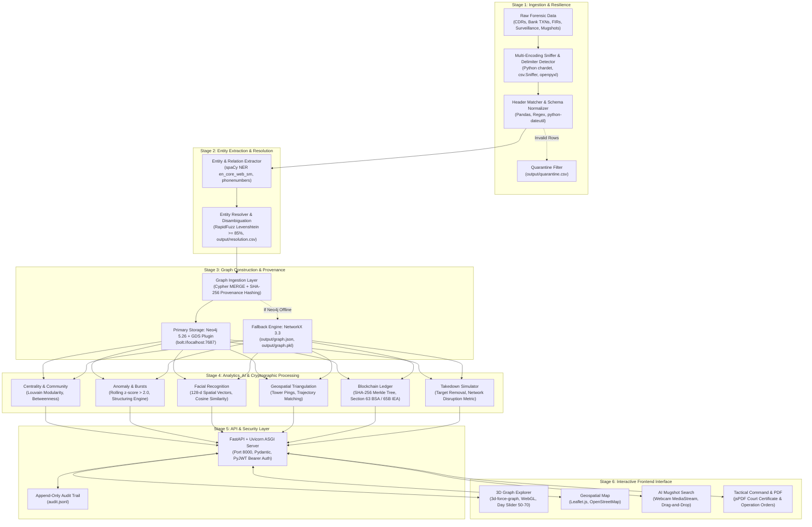

# Criminal Network Analysis System — Complete Architecture & Workflow

The **Criminal Network Analysis System** is an enterprise-grade, intelligence-fusion platform designed for law enforcement agencies and investigators. It ingests multi-modal forensic datasets (telecom Call Detail Records [CDRs], banking transactions, police First Information Reports [FIRs], surveillance notes, and social media), performs AI-driven entity extraction and fuzzy resolution, constructs a unified knowledge graph with cryptographic chain-of-custody provenance, and runs advanced graph analytics, geospatial tracking, facial recognition, and tactical takedown simulations.

---

## 1. System Technology Stack (Bullet Points)

### Frontend Tech Stack
* **Core Markup & Architecture**: Semantic HTML5, Single Page Application (SPA) architecture with view routing.
* **Styling & Design System**: Responsive CSS3 with custom CSS Variables, Flexbox/Grid layouts, and a Flat Obsidian Dark / Modern Light theme engine.
* **Core Logic & Scripting**: Vanilla JavaScript (ES6+) — zero build-step overhead, native asynchronous `fetch` client, state management.
* **3D Graph Visualization Engine**: [`3d-force-graph`](https://unpkg.com/3d-force-graph) powered by **WebGL / Three.js** for 3D orbital camera navigation, dynamic clustering, edge directional particle flows, and gold glow bridge rendering.
* **Geospatial & Mapping Engine**: [`Leaflet.js (v1.9.4)`](https://unpkg.com/leaflet@1.9.4/dist/leaflet.js) integrated with OpenStreetMap tiles for cell tower triangulation, route paths, and co-location heatmaps.
* **Client-Side PDF Document Generator**: [`jsPDF (v2.5.1)`](https://cdnjs.cloudflare.com/ajax/libs/jspdf/2.5.1/jspdf.umd.min.js) for generating formal court certificates, intelligence dossiers, and tactical operation orders.
* **Media & Camera Integration**: Native HTML5 `MediaDevices.getUserMedia()` Web API for real-time webcam CCTV capture for facial search.

### Backend Tech Stack
* **Web Framework & API**: `FastAPI (v0.110.0)` with automatic OpenAPI/Swagger interactive documentation (`/docs`).
* **ASGI Production Server**: `Uvicorn[standard] (v0.29.0)` for asynchronous non-blocking request handling.
* **Data Processing & Tabular Modeling**: `Pandas (v2.2.2)` and `NumPy` for multi-stream normalization and rolling-window statistical computations.
* **Spreadsheet Ingestion**: `openpyxl (v3.1.5)` for multi-sheet Excel workbook parsing.
* **Data Validation & Typing**: `Pydantic (v2.7.1)` for schema validation, request payload checking, and response serialization.
* **Date & Timestamp Parsing**: `python-dateutil (v2.9.0)` for ISO-8601, RFC-2822, and multi-format timestamp normalization.

### Graph & Database Tech Stack
* **Primary Graph Database**: **Neo4j 5.26 Community** running Cypher `MERGE` transactions with property constraints and schema indexing.
* **Neo4j Graph Data Science (GDS)**: GDS Plugin for production PageRank, Betweenness, and Louvain community algorithms.
* **Python Graph Client**: `neo4j (v5.20.0)` official Python Bolt driver.
* **In-Memory Graph Engine & Resilient Fallback**: `NetworkX (v3.3)` providing zero-dependency graph persistence (`graph.json`, `graph.pkl`) and graph computation when Neo4j is offline.

### AI, NLP & Computer Vision Stack
* **Natural Language Processing & Named Entity Recognition (NER)**: `spaCy (v3.7.4)` with `en_core_web_sm` model for unstructured police FIR narratives and intelligence extraction.
* **Telecom Phone Extraction & Formatting**: `phonenumbers (v8.13.48)` (Google libphonenumber port) for canonical E.164 parsing.
* **Entity Resolution & String Matching**: `RapidFuzz (v3.9.6)` for Levenshtein/Jaro-Winkler fuzzy matching against criminal aliases.
* **Facial Recognition & Visual Search Engine**: `backend/analytics/face_search.py` using 128-dimensional spatial intensity block projection & normalized gradient embeddings with vector Cosine Similarity matching against booking mugshots.

### Security, Cryptography & Compliance Stack
* **Authentication & Authorization**: `PyJWT (v2.10.1)` implementing stateless HMAC-SHA256 JWT tokens with Role-Based Access Control (RBAC: `supervisor`, `investigator`, `analyst`).
* **Blockchain Evidence Ledger**: `backend/analytics/blockchain_ledger.py` computing sequential SHA-256 block hashing and hierarchical Merkle Tree proofs.
* **Legal Digital Evidence Compliance**: Formatted according to Section 63 of the Bharatiya Sakshya Adhiniyam (BSA), 2023 / Section 65B of the Indian Evidence Act (IEA) and ISO/IEC 27037 standards.
* **Audit Trail**: Strict append-only ledger (`audit.jsonl`) recording timestamp, username, query, and accessed entity IDs on every route.

### DevOps, Containerization & Testing
* **Containerization**: Docker multi-stage builds (`Dockerfile`) and `docker-compose.yml` orchestrating Neo4j and FastAPI.
* **Automated Testing Suite**: `pytest` running comprehensive unit, pipeline, integration, and API contract tests across `tests/`.

---

## 2. Frontend Architecture & Details

The frontend is housed in `frontend/index.html`. It contains a complete single-page application without external bundler dependencies, communicating via REST with the backend.

```
┌────────────────────────────────────────────────────────────────────────┐
│                          FRONTEND (SPA)                                │
│                                                                        │
│  ┌────────────────────┐ ┌───────────────────────────────────────────┐  │
│  │   Sidebar Nav      │ │             Active View                   │  │
│  │  - Command (Admin) │ │  - 3D WebGL Force Graph                   │  │
│  │  - Dashboard       │ │  - Leaflet.js Geospatial Map              │  │
│  │  - Investigations  │ │  - Tactical Takedown Simulator            │  │
│  │  - People Directory│ │  - Blockchain Evidence Explorer           │  │
│  │  - Timeline        │ │  - jsPDF Intelligence Dossier Generator   │  │
│  │  - Financial       │ │  - Webcam / Mugshot AI Facial Matcher     │  │
│  │  - Evidence & Cust │ │  - Natural Language Cypher Query Bar      │  │
│  └────────────────────┘ └───────────────────────────────────────────┘  │
└────────────────────────────────────────────────────────────────────────┘
```

### Key Frontend Views & Capabilities:
1. **Access Management & RBAC Portal (`#view-login`)**:
   - Secure sign-in and formal Departmental Access Request modal with badge ID, designation, and justification.
   - Dynamic UI customization based on assigned roles (`supervisor`, `investigator`, `analyst`).
2. **Command & Administrative Center (`#view-admin-dashboard`)**:
   - Supervisor dashboard for user approval/rejection, account suspensions, password resets, and live audit trail streaming from `audit.jsonl`.
3. **Multi-Case Investigation Hub (`#view-investigations`, `#view-new`, `#view-mapping`)**:
   - Multi-case isolation (`/investigations/{iid}`).
   - Drag-and-drop file ingestion, automatic format detection, and custom column-mapping interface for disparate CSV/Excel schemas.
   - **Interactive Schema Reference Modal**: Schema documentation with one-click starter CSV template downloaders.
4. **Interactive 3D Knowledge Graph (`#view-overview`)**:
   - Rendered using WebGL `3d-force-graph`.
   - 3D spatial orbit camera controls, zoom, pan, and dynamic node physics.
   - Nodes categorized and color-coded by criminal gang/cell; bridge nodes highlighted with gold particle glow.
   - Interactive temporal timeline slider (Days 50 to 70) with auto-play animation showing network evolution.
   - **Why Drawer**: Slide-out panel presenting dynamic evidence rationales, centrality scores, and source citations.
5. **AI "Search by Image" & People Directory (`#view-people`, `#view-person`)**:
   - Suspect dossiers with booking photos, aliases, phone numbers, bank accounts, and prior charges.
   - **Visual Search Modal**: Upload photo, CCTV still, or take a live snapshot via webcam. Compares face vector similarity against mugshot archives and displays confidence match percentages.
6. **Geospatial Tracking & Triangulation (`#view-geospatial`)**:
   - Interactive Leaflet.js map with custom tower markers, signal coverage radiuses, suspect travel trajectories, and co-location hotspots.
7. **Financial & Hawala Intelligence (`#view-financial`)**:
   - Automated detection of smurfing/structuring patterns (>= 10 small transactions under Rs 50,000) and money laundering flow graphs.
8. **Communications & Cell Bursts (`#view-communications`, `#view-intelligence`)**:
   - Call Detail Record (CDR) frequency matrices, communication hubs, and coordinated activity spikes (z > 2.0).
9. **Blockchain Evidence Explorer & Chain of Custody (`#view-blockchain`)**:
   - Visual cryptographic block explorer showing block hashes, previous block linkages, and Merkle tree roots.
   - Live hash verification tool and one-click court-admissible PDF Certificate generator.
10. **Tactical Takedown Simulator (`#view-takedown`)**:
    - Interactive arrest optimizer allowing commanders to select target suspects and test network collapse percentage, isolated nodes, and residual gang risks.
    - Generates formal Indian Law Enforcement **Operation Orders** (e.g., *Operation Thunderclap*) exportable to PDF.

---

## 3. Backend Architecture & Details

The backend is built around a modular architecture centered on `backend/api/main.py`.

```
                      ┌─────────────────────────┐
                      │  FastAPI Web Service    │
                      │  (Uvicorn / Port 8000)  │
                      └────────────┬────────────┘
                                   │
       ┌───────────────────────────┼──────────────────────────┐
       ▼                           ▼                          ▼
┌───────────────┐          ┌───────────────┐          ┌───────────────┐
│ Ingestion &   │          │ Graph Engine  │          │ Specialized   │
│ Normalization │          │ & Schema      │          │ Analytics     │
│ (loader.py /  │          │ (Neo4j /      │          │ (12 Modular   │
│ mapper.py)    │          │ NetworkX)     │          │ Engines)      │
└───────────────┘          └───────────────┘          └───────────────┘
```

### Core Backend Components:

1. **Ingestion & Schema Normalizer (`backend/loader.py`, `backend/ingestion/`)**:
   - Ingests raw CSVs, TSVs, and Excels (724 CDRs, 158 transactions, 35 FIRs, surveillance logs, etc.).
   - Header cleaner with 100+ alias matching dictionary.
   - Strips ground-truth leakages and routes corrupted rows to `quarantine.csv`.

2. **Entity Extractor & Resolver (`backend/extraction/`, `backend/resolution/`)**:
   - Extracts `Person`, `Phone`, `Account`, `Location`, `Vehicle`, and `Organization` entities.
   - Uses `phonenumbers` for international telecom validation and spaCy NER for unstructured narrative text.
   - Employs `RapidFuzz` Levenshtein similarity (>= 85%) alongside exact identifiers to resolve alias variations (e.g., *Ramesh Yadav* <-> *Rmesh Yadav*) into canonical Master IDs stored in `output/resolution.csv`.

3. **Graph Builder & Dual-Layer Storage (`backend/graph/`)**:
   - **Production Mode**: Connects via Bolt to Neo4j, applying schema constraints and inserting nodes and relationships (`CALLED`, `TRANSACTED`, `MENTIONED_IN`, `CO_LOCATED`) with full provenance (source file, row ID, confidence, timestamp, SHA-256 evidence hash).
   - **Resilient Fallback**: If Neo4j is unavailable, it automatically uses NetworkX with zero downtime, persisting serial graph models to `output/graph.json` and `output/graph.pkl`.

4. **12 Modular Analytics Engines (`backend/analytics/`)**:
   - **Centrality Engine (`centrality.py`)**: Computes Degree, Betweenness, Eigenvector, and Closeness centralities to pinpoint gang leaders and communication hubs.
   - **Community Detection (`community.py`)**: Implements Louvain modularity to partition nodes into criminal syndicates (e.g., Cell A, Cell B, Cell C).
   - **Bridge Detection (`bridge_detection.py`)**: Identifies key intermediaries across cells using a combined metric:
     Bridge Score = 0.6 * Normalized Betweenness + 0.4 * Cross-Community Edge Ratio
   - **Burst Detection (`burst_detection.py`)**: Computes rolling-window z-scores on communication frequencies to detect spikes (z > 2.0) predicting operations.
   - **Financial Anomaly (`financial_anomaly.py`)**: Detects structuring/smurfing patterns and high-velocity money laundering.
   - **Lead Scoring (`lead_scoring.py`)**: Produces dynamic 0–100 investigative priority rankings with risk categorizations (CRITICAL, HIGH, MEDIUM, LOW).
   - **Cross-Case Link Analysis (`cross_case.py`)**: Discovers shared phone numbers, accounts, and vehicles across unrelated FIRs.
   - **Geospatial Movement & Triangulation (`geospatial.py`)**: Models cell tower movement trajectories, timestamp overlaps, and co-location meeting hotspots.
   - **Facial Recognition Search (`face_search.py`)**: Vector embedding and cosine similarity search for suspect mugshots.
   - **Tactical Takedown Simulator (`takedown_simulator.py`)**: Simulates arrest outcomes, calculating network fragmentation, communication drops, and isolated entities.
   - **Blockchain Chain of Custody (`blockchain_ledger.py`)**: Builds sequential SHA-256 evidence blocks and Merkle trees for court-admissible digital verification.
   - **Natural Language Cypher Engine (`/ask`)**: Translates natural language queries (e.g., *"Who connects Cell A and Cell B?"*, *"Show transactions over 2 lakh"*) into executable Cypher queries.

---

## 4. End-to-End System Workflow (with Tech Stack at Every Step)

The diagram below tracks the complete journey of forensic evidence from initial ingestion to interactive visualization and tactical operations:



---

## 5. Detailed Step-by-Step Flow & Tech Stack Mapping

| Phase | Operational Steps | Tech Stack & Libraries Involved | Key Outputs / Artifacts |
| :--- | :--- | :--- | :--- |
| **1. Data Ingestion** | • Upload or load files from raw sources.<br>• Sniff encoding, line endings, and delimiters.<br>• Clean headers against 100+ aliases.<br>• Normalize dates and monetary values.<br>• Strip ground-truth flags to avoid data leakage. | `Python 3.11+`, `Pandas`, `openpyxl`, `python-dateutil`, `csv`, `chardet` | `quarantine.csv`, normalized memory dataframes |
| **2. Entity Extraction & Resolution** | • Parse telecom CDRs into phone nodes and calls.<br>• Parse financial records into accounts and transactions.<br>• Run NER on FIR and surveillance narratives.<br>• Match phone/account numbers and fuzzy-match name aliases (>= 85%).<br>• Generate Master IDs. | `spaCy (v3.7.4)`, `en_core_web_sm`, `phonenumbers (v8.13.48)`, `RapidFuzz (v3.9.6)` | `output/resolution.csv`, Master Entity mapping |
| **3. Graph Ingestion** | • Create unique constraints and indexes.<br>• Execute transactional Cypher `MERGE` statements.<br>• Embed provenance metadata (source file, row number, confidence, timestamp, SHA-256 hash) on every edge.<br>• Serialize backup graph structures. | `Neo4j 5.26-community`, `neo4j-python-driver (v5.20.0)`, `NetworkX (v3.3)` | Neo4j Database, `output/graph.json`, `output/graph.pkl` |
| **4. Advanced Analytics & AI** | • **Louvain Community Detection**: Partitions graph into criminal cells (A, B, C).<br>• **Centrality Algorithms**: Calculates betweenness, degree, and closeness.<br>• **Bridge Detection**: Ranks cross-cell intermediaries ($0.6 \times \text{betweenness} + 0.4 \times \text{cross-edges}$).<br>• **Burst Detection**: Evaluates rolling communication $z$-scores ($z > 2.0$).<br>• **Financial Anomaly**: Identifies structuring (>= 10 transactions < Rs 50,000).<br>• **Facial Search**: Computes 128-d face embeddings and cosine similarities.<br>• **Geospatial Analysis**: Triangulates cell towers and computes co-location hotspots.<br>• **Blockchain Ledger**: Chains SHA-256 evidence blocks and computes Merkle roots. | `NumPy`, `Pandas`, `NetworkX`, `Neo4j GDS`, `hashlib`, `json` | Centrality rankings, bridge lists, anomaly flags, blockchain ledger, suspect trajectory vectors |
| **5. API & Security Layer** | • Validate JWT Bearer tokens and verify user permissions (`supervisor`, `investigator`, `analyst`).<br>• Route API requests to graph analytics modules.<br>• Log all API accesses with timestamps, user credentials, queries, and entity IDs to an append-only audit trail. | `FastAPI (v0.110.0)`, `Uvicorn (v0.29.0)`, `Pydantic (v2.7.1)`, `PyJWT (v2.10.1)` | Append-only `audit.jsonl`, JSON responses, OpenAPI `/docs` |
| **6. User Interface & Decision Support** | • **3D Graph View**: Renders WebGL graph with orbital camera controls and temporal day slider.<br>• **Why Drawer**: Reveals multi-source evidence citations.<br>• **Search by Image**: Uploads suspect photos/webcam frames to find visual matches.<br>• **Geospatial Map**: Plots suspect movements and tower heatmaps via Leaflet.js.<br>• **Takedown Simulator**: Interactive arrest planning and network collapse calculations.<br>• **PDF Export**: Generates court-admissible digital evidence certificates and Police Operation Orders. | HTML5, CSS3 Variables, Vanilla JavaScript (ES6+), `3d-force-graph` (Three.js/WebGL), `Leaflet.js`, `jsPDF`, HTML5 `getUserMedia()` | Interactive browser UI, Client-side generated PDF dossiers |
