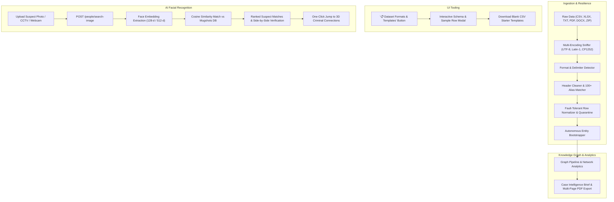

# Comprehensive System Roadmap & Enhancement Plan (`upcoming_plan.md`)

## 1. Overview & Objectives
This document outlines the master architectural and implementation roadmap for three major capability pillars in the **Criminal Network Analysis System**:
1. **Universal Dataset Compatibility & Ingestion Resilience**: Parsing and analyzing arbitrary datasets (telecom CDRs, bank transactions, police FIRs, surveillance logs, plain text reports, PDFs, Word documents, and multi-sheet Excels) without rigid schema lock-in.
2. **Interactive "Dataset Formats & CSV Templates" Viewer**: Built-in UI schema guide and one-click starter CSV template downloader for investigators.
3. **AI Facial Recognition & Criminal Mugshot "Search by Image" Engine**: Visual search system allowing investigators to upload photos, CCTV stills, or capture webcam frames to instantly identify suspects, compare side-by-side match confidence, and explore their 3D criminal network.

---

## 2. System Architecture Workflow

---

## 3. Detailed Component Roadmap

---

### Pillar 1: AI Facial Recognition & Criminal Mugshot "Search by Image"

#### A. Criminal Mugshot Dataset Integration
* **Asset Directory**: Establish `data/mugshots/` storing high-resolution police booking photos (e.g. `A1.jpg`, `A2.jpg`, `B1.jpg`, `X1.jpg`, `N1.jpg`...).
* **People Directory Updates**: Update `data/people_directory.json` to link each person profile to their mugshot image URL/path (`"photo": "/mugshots/A1.jpg"`).
* **Precomputed Embedding Cache**: Generate and cache facial feature vectors (`data/face_embeddings.json`) during startup for ultra-fast sub-50ms matching.

#### B. Facial Search Backend Engine (`backend/analytics/face_search.py`)
* **Detection & Embedding**: Lightweight face detection and vector extraction engine (OpenCV DNN / MobileFaceNet / FaceNet).
* **Cosine Similarity Matcher**: Calculates similarity scores (0% to 100%) against all registered criminals.
* **New Endpoints**:
  * `POST /people/search-image`: Accepts multipart photo upload (CCTV crop, mobile photo, ID scan) and returns ranked candidate suspects with match percentages and criminal summaries.
  * `GET /mugshots/{filename}`: Secure static image streaming endpoint.

#### C. Frontend "Search by Image" Interface (`#view-people`)
* **Visual Search Action Bar**: New **"📷 Search by Photo / CCTV"** button adjacent to the text search bar.
* **Upload & Capture Modal**: Drag-and-drop file zone with image preview + optional live webcam snapshot.
* **Match Results & Side-by-Side Review**:
  * Query photo displayed directly beside the matched database mugshot.
  * Match meter badge (e.g., `96.4% Match — High Probability`).
  * Suspect dossier card (Role, cell, active phone numbers, bank accounts, prior FIR charges).
  * One-click **"Open in Network Graph"** button.
* **Mugshot Avatars**: Display photos across People profile cards, 3D graph tooltips, and Intelligence Brief reports.

---

### Pillar 2: Interactive "Dataset Formats & CSV Templates" Reference Viewer

#### A. UI Reference Modal (`frontend/index.html`)
* **Trigger Button**: **"📋 View Expected Formats & Templates"** button added in the **Investigations** header and the **Upload Case Data** modal.
* **8 Tabbed Schema Guides**:
  1. 📞 **Call Detail Records (CDRs)**: `caller_phone`, `callee_phone`, `timestamp`, `duration_sec`, `cell_tower_location`, `call_type`.
  2. 💳 **Financial Transactions**: `sender_id`, `sender_name`, `sender_account`, `receiver_id`, `receiver_name`, `receiver_account`, `amount_inr`, `timestamp`, `txn_type`.
  3. 📄 **Police FIRs**: `fir_id`, `date`, `station`, `location`, `ipc_sections`, `narrative`.
  4. 👁️ **Surveillance Reports**: `report_id`, `date`, `team`, `location`, `activity_notes`, `confidence`.
  5. 🕵️ **Intelligence Reports**: `report_id`, `date`, `source_reliability`, `narrative`.
  6. 📱 **Social Media Posts**: `post_id`, `handle`, `person_id`, `timestamp`, `post_text`, `hashtags`, `location_tag`.
  7. ⚖️ **Criminal History**: `record_id`, `person_id`, `name`, `alias`, `dob`, `prior_offences`, `gang_affiliation`, `known_address`.
  8. 👤 **People Directory**: `id`, `name`, `phone`, `account`, `cell`, `role`.
* **Field Requirement Indicators**: Visual tags distinguishing `Required` core columns from `Optional / Inferred` metadata.
* **Live Sample Data Tables**: Interactive preview rows demonstrating real-world formatting.
* **One-Click Download**: Instant download of clean `.csv` template starter files ready for data entry.

---

### Pillar 3: Universal Dataset Compatibility & Fault-Tolerant Ingestion

#### A. Extended File Format & Document Handlers
* **Plain Text Files (`.txt`, `.log`, `.tsv`)**: Auto-detect delimiter tables vs free-form text reports (ingested as narrative FIRs/Intel).
* **Word Docs (`.docx`) & Legal PDFs (`.pdf`)**: Extract paragraphs, FIR case numbers, accused names, and timestamps.
* **Multi-Sheet Excel Workbooks (`.xlsx`, `.xls`)**: Automatically iterate over all sheets and process each as an independent dataset stream.

#### B. Multi-Encoding Sniffer & Delimiter Detection
* **Encoding Sequence**: Tries `utf-8-sig` → `utf-8` → `latin-1` → `cp1252` → `iso-8859-1`.
* **Delimiter Sniffing**: Commas (`,`), semicolons (`;`), tabs (`\t`), and pipes (`|`).

#### C. 100+ Telecom, Banking & Police Column Aliases
* **CDRs**: `msisdn`, `a_num`, `b_num`, `calling_no`, `called_no`, `originating_no`, `terminating_no`, `cell_id`, `imei`, `imsi`.
* **Transactions**: `remitter`, `beneficiary`, `payer`, `payee`, `debit_acc`, `credit_acc`, `txn_val`, `debit_inr`, `credit_inr`, `particulars`, `narration`.
* **FIRs / Text**: `facts`, `brief_facts`, `allegation`, `accused_name`, `complainant_name`, `incident_summary`.

#### D. Fault-Tolerant Cleansing & Row-Level Quarantine
* **Currency / Amount Normalizer**: Cleans `₹45,000.00`, `$12,500`, `45000/-`, `2.5L`, `3.2 Cr`.
* **Date Normalizer**: Handles ISO, `DD/MM/YYYY`, `MM/DD/YYYY`, epoch timestamps, and sequential days.
* **Row-Level Quarantine**: Routes broken rows to `quarantine.csv` with specific failure reasons, allowing the remainder of the file to build into the graph without stopping the case.

#### E. Autonomous Entity Bootstrapping
* Auto-creates suspect profiles from distinct phone numbers, bank accounts, and caller/callee names when no pre-existing `people_directory.json` is supplied.

---

## 4. Master Implementation Checklist

1. [x] **Facial Recognition & Mugshots**:
   - [x] Add suspect mugshot images to `data/mugshots/`.
   - [x] Update `data/people_directory.json` with photo references.
   - [x] Implement `backend/analytics/face_search.py` and `POST /people/search-image`.
   - [x] Build the "📷 Search by Photo / CCTV" modal and side-by-side comparison in `frontend/index.html`.
2. [x] **Dataset Formats & Templates Viewer**:
   - [x] Build the modal displaying all 8 dataset schemas and sample tables.
   - [x] Add one-click CSV starter template downloads.
3. [x] **Ingestion Engine & Parsers**:
   - [x] Add multi-encoding reader (`utf-8`, `latin-1`, `cp1252`).
   - [x] Add `.txt`, `.tsv`, `.pdf`, `.docx`, and multi-sheet `.xlsx` handlers in `backend/ingestion/detector.py`.
   - [x] Add 100+ aliases and header cleaner in `backend/ingestion/mapper.py`.
   - [x] Add currency and date cleanser in `backend/ingestion/normalizer.py`.
4. [x] **Verification & Validation**:
   - [x] Run full pytest suite (`python3 -m pytest tests/`).
   - [x] Test image search with matching and non-matching faces.
   - [x] Test uploading custom messy files with missing non-critical columns.
